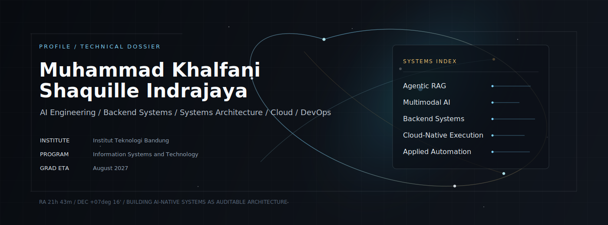
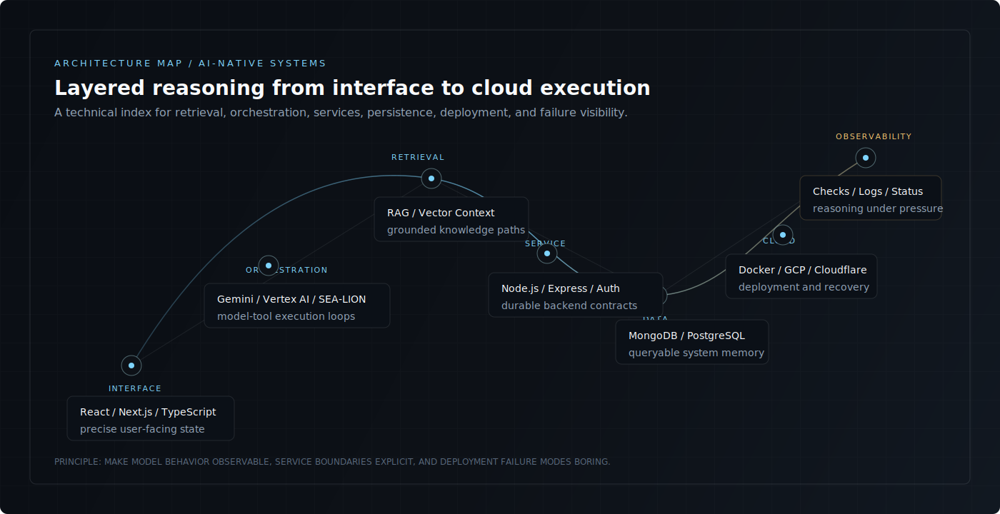
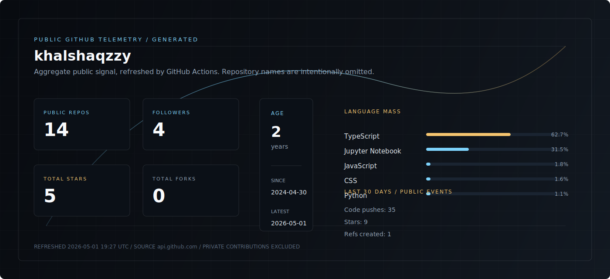
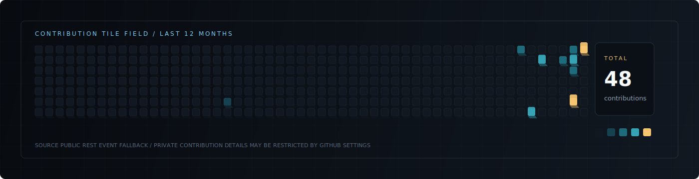

  

  
  
  

---

### Systems Thesis

I build AI-native systems where retrieval, model orchestration, backend services, systems architecture, and cloud execution behave as one coherent machine. My current focus is on **agentic RAG**, **multimodal AI**, **backend systems**, **systems architecture**, **cloud-native systems**, and **applied automation**.

  

 

### Architecture Layers

| Layer | Operating Surface | Current Signal |
|---|---|---|
| Interface | React, Next.js, TypeScript, canvas-oriented interaction models | User-facing AI workflows with precise state and feedback |
| Orchestration | Gemini API, Vertex AI, SEA-LION, function calling, LLM pipelines | Tool-using agents, multimodal reasoning, model-directed execution |
| Retrieval | RAG, vector search concepts, document-aware context flows | Grounded AI systems with traceable knowledge paths |
| Service | Node.js, Express.js, JWT, REST, realtime channels | Durable APIs, auth boundaries, event-driven collaboration |
| Data | MongoDB, PostgreSQL, SQL, structured persistence | Queryable state, auditability, and data contracts |
| Cloud | Docker, GitHub Actions, GCP, Cloudflare | Build, deploy, backup, and release discipline |
| Observability | Status surfaces, deployment checks, failure visibility | Systems that can be reasoned about under pressure |

 

### Capability Index

**Languages**

  

**Frameworks and Runtime**

  

**Data and Cloud**

  

**Tools**

  

**AI Systems**

  
  
  
  
  
  
  
  
  

 

### Engineering Modes

| Mode | What I Care About |
|---|---|
| **AI Systems Engineer** | Model-tool loops, retrieval quality, multimodal flows, function calling, and grounded responses |
| **Backend Architect** | API boundaries, auth, persistence, realtime communication, and service reliability |
| **Systems Architecture** | Clear contracts between interface, orchestration, data, and deployment layers |
| **Cloud Builder** | Containerized delivery, CI/CD guardrails, cloud operations, and recovery planning |

 

### Recognition

| Signal | Context |
|---|---|
| **Most Innovative Use of SEA-LION Models** | Pan-SEA AI Developer Challenge 2025 |
| **1st Place Software Development** | IT Festival, IPB University 2025 |

 

### Telemetry

<!-- GITHUB_TELEMETRY:START -->

  

  

| Signal | Public GitHub API value |
|---|---:|
| Public repositories | 14 |
| Followers | 4 |
| Total public stars | 5 |
| Total public forks | 0 |
| Top visible languages | TypeScript 62.7% / Jupyter Notebook 31.5% / JavaScript 1.8% / CSS 1.6% / Python 1.1% |
| Contribution tile source | Public REST event fallback |
| Last 12 months contributions | 48 |
| Recent public activity | Code pushes: 35 / Stars: 9 / Refs created: 1 |
| Last public repository update | 2026-05-01 |
| Telemetry refresh | 2026-05-01 19:27 UTC |

<!-- GITHUB_TELEMETRY:END -->

  

---

  <code>AI Engineering</code> / <code>Backend Systems</code> / <code>Systems Architecture</code> / <code>Cloud / DevOps</code>

  <a href="mailto:khalshaquille03@gmail.com">Email</a> /
  <a href="https://github.com/khalshaqzzy">GitHub</a> /
  <a href="https://www.linkedin.com/in/khalfani-indrajaya">LinkedIn</a>

